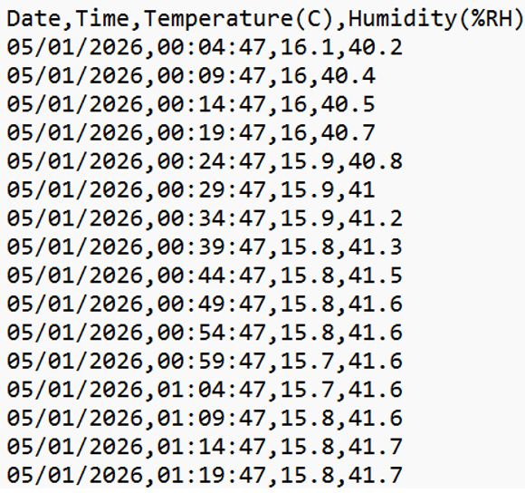

# myDataViewer

This apps main task is to allow you to visualise temperature and humidity data that has been recorded into a comma separated value (csv) file. 

### How it works.
 
Open the app and you will have the following GUI.

Buttons and other UI Controls will appear or disappear depending on the choices you make as you work with the app.

#### CSV Data

The folder structure where the data is stored and how it is named is important. The app starts to look under the folder Data into subfolders for the year, then under the year into subfolders for the months (Sentence case for months). Under the months are the csv files for that month. This is illustrated below:

The layout of the csv file is shown below:

### Open Data Location

Click on the “Open Data Location” button and choose the folder where all your data is stored. The app will now search that folder and list with checkboxes all the year folders  

When you check the box next to the year you want the app searches the year folder and will list the months.

When you check the box next to the month you want the app searches the month folder and will list the csv files it finds in that folder.

Now you can check the sensors that you want to graph. When you have made your selection click the button called “Load Data”.

This will now graph the Temperature and Humidity data. The graphs are in two separate tabs; click on the tab to view the data you want to view.

The graph will only allow 140 different sensor plots at the same time although with that many plots the data will be very dense and may just look like a black splodge.
 
### A note on the Horizontal X-Axis
This axis shows is used to plot the date and time. To allow for comparison of data from months of different lengths or part months with data from full months the date and time is converted into time from start of month. 

### Tooltips
If you put your mouse over a charted line and it finds a charted point then you will get a tooltip telling you the value and the date and time of that point.

### Comparing Data
This is useful to compare data from the same sensor over different seasons. To do this check the checkbox called “Compare Mode”. Now every time you choose a year, month or sensor and loads its data it will be superimposed over all the existing data. Below you can see data for the outside sensor being compared for three different months. Note that we can chart data even for incomplete months.

You can also compare data from different sensors in different seasons if you so wish. 

### Save Chart Image
Click on the “Save Chart Image” and you will be able to select where you save the image and what you call it. The size you save will depend on the size you have the app working at. For the best results maximise the app.

### Clear Chart Images
Click on “Clear Chart” will remove the chart from the app. 

### Zooming into and out of the Chart
Zooming is useful to get deeper into the plots to check them in more detail. There are various ways to zoom into and out of the chart.

1)	Check the “Allow Zooming” checkbox. You will see a “Reset Zooming” button now appears.

If you now place your mouse on the chart and click and hold the left mouse button and drag the mouse and you will see a grey box appear. This defines the area that will be zoomed in. When you let go of the left mouse button the chart will zoom in.

Note that you now see the scrollbars now appear for both axis. You can zoom in as many levels as you want by just repeating the method described above.

There are several ways to zoom out. 
  •	If you click the end of the scroll bar as shown in the circled in the image below you will zoom out by one level each time. 

  •	Clicking on “Reset Zoom” will also zoom out by one level each time you click it.
  •	Double Clicking the left mouse button will also zoom out by one level each time you click it.

2)	You can also use the mouse wheel to scroll zoom in and out. This works independently of the Allow Zoom Checkbox state. The behaviours of this way of zooming are different to that described above:  
  •	Moving wheel scroll 
      o	Forward zooms in
      o	Backwards zooms out 
  •	Wheel scroll zooms both X-Axis and Y-Axis
  •	Control + wheel scroll zooms X-Axis
  •	Shift + wheel scroll Zooms Y-Axis
  •	Control + Shift + wheel scroll = ultrafine scrolling
  •	If the Zoom checkbox is unchecked then Double clicking the left mouse button will reset the chart to original size.

### Crosshairs
There are two different types of crosshairs you can use. One is static and the other when activated follows the mouse movement.

1)	Check the checkbox to activate the “Show Crosshairs”. Now click on a point on the charted line and you will get the static red cross hairs. It will also show a tooltip if you are on a charted point. You can click at another point and the crosshair will move to that point but will not move with the mouse movement. To remove the crosshairs uncheck the “Show Crosshairs” checkbox.

2)	If the “Show Crosshairs” checkbox is unchecked and you left click on the chart then you will get the movable crosshairs. There will also be a tooltip showing the value of that point even if it not on a charted line. The crosshairs will follow your mouse movements which will allow you to follow the charted lines. To remove the crosshair just right click your mouse.

End of File

