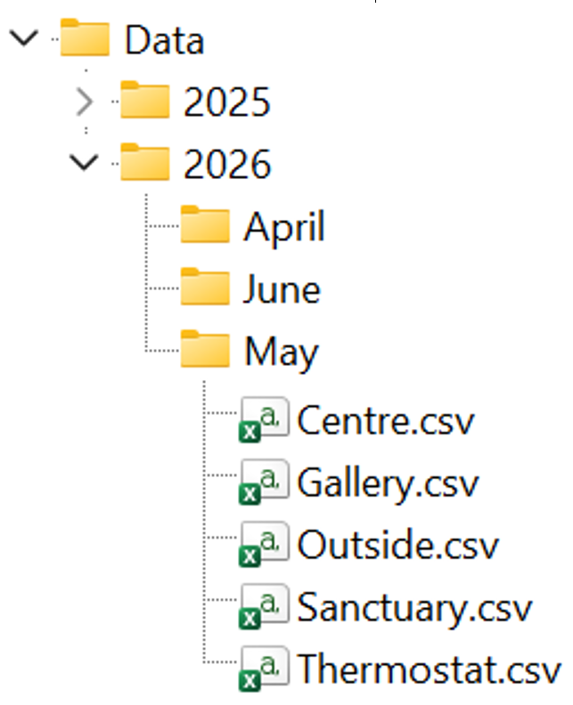

# myDataViewer

This apps main task is to allow you to visualise temperature and humidity data that has been recorded into a comma separated value (csv) file. 

### How it works.
 
Open the app and you will have the following GUI.

Buttons and other UI Controls will appear or disappear depending on the choices you make as you work with the app.

#### CSV Data

The folder structure where the data is stored and how it is named is important. The app starts to look under the folder Data into subfolders for the year, then under the year into subfolders for the months (Sentence case for months). Under the months are the csv files for that month. This is illustrated below:

